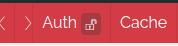
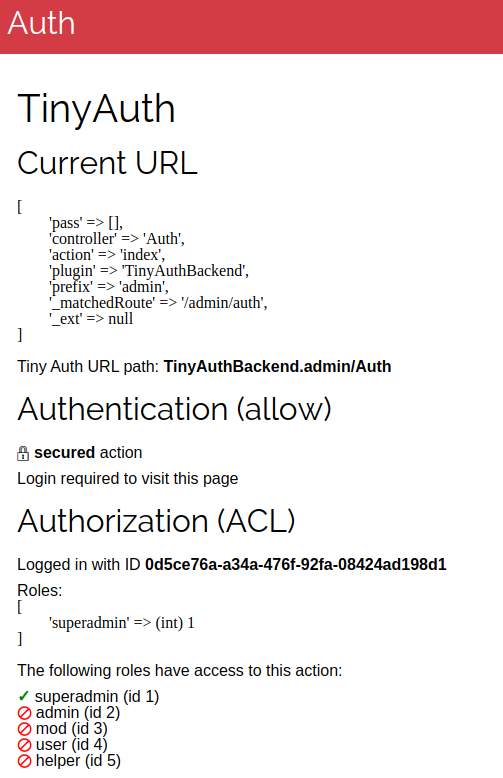

## DebugKit Auth Panel
The TinyAuth plugin ships with a useful DebugKit panel to show quickly if the current action
- is public (allowed in auth_allow.ini) or protected
- if protected what roles have access to it

Also:
- auth status of current user (guest, logged in, ...)
- if logged in your current role(s)

Public action (quick icon):



Protected action (quick icon):


Panel showcase once opened:



### Enable the panel
Activate the panel in your config:

```php
    'DebugKit' => [
		'panels' => [
			...
			'TinyAuth.Auth' => true,
		],
	],
```

Now it should be visible in your DebugKit panel list.

Note: If you only use TinyAuth authentication or authorization (and not both) it will usually detect this and not display the unused part.
Make sure you enabled the documented components and helpers here to have all features enabled.
